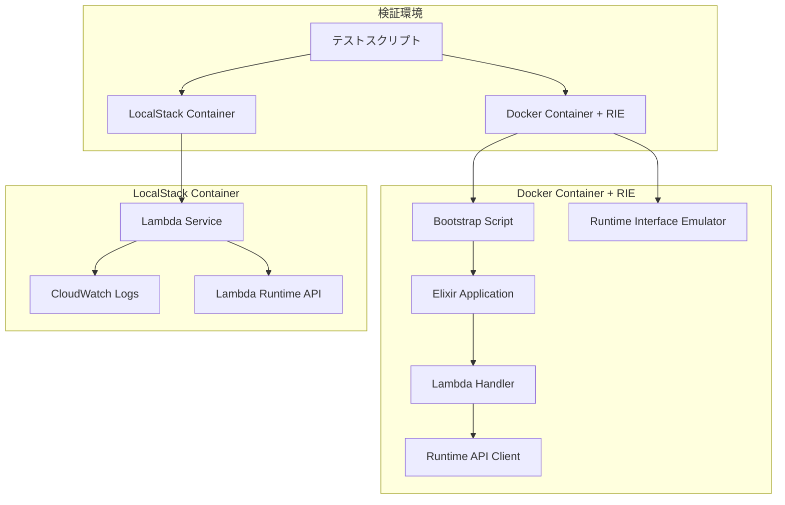
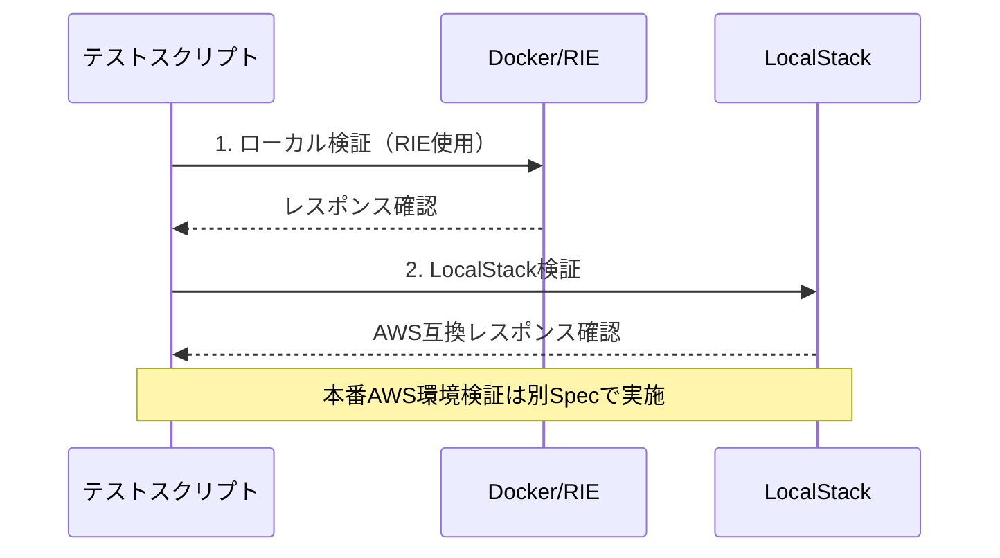

# 設計書

## 概要

この設計書は、ElixirベースのAWS Lambda関数「闘魂Lambda」の動作検証システムの設計を定義します。検証システムは、ローカル環境（RIE使用）とLocalStack環境での動作を段階的に検証し、Lambda Runtime APIの実装が正しく動作することを確認します。本番AWS環境での検証は別のSpecで実施します。

## アーキテクチャ

### システム構成図



### 検証フロー



## コンポーネントと インターフェース

### 1. 検証テストスイート

**責任:** 各環境での検証テストを実行し、結果を評価する

**インターフェース:**
- `run_local_verification()` - RIEを使用したローカル検証
- `run_localstack_verification()` - LocalStackを使用した検証
- `validate_response(response)` - レスポンス検証
- `generate_test_report()` - 検証結果レポート生成

### 2. Docker検証コンポーネント

**責任:** Dockerコンテナの構成とRIEでの動作を検証

**インターフェース:**
- `build_docker_image()` - Dockerイメージビルド
- `start_container_with_rie()` - RIEでコンテナ起動
- `send_test_request(payload)` - テストリクエスト送信
- `verify_container_logs()` - コンテナログ検証

### 3. LocalStack検証コンポーネント

**責任:** LocalStack環境でのLambda関数デプロイと実行検証

**インターフェース:**
- `setup_localstack()` - LocalStack環境セットアップ
- `deploy_lambda_function()` - Lambda関数デプロイ
- `invoke_lambda_function(event)` - Lambda関数呼び出し
- `verify_aws_compatibility()` - AWS互換性検証


### 5. Lambda Runtime API検証

**責任:** Lambda Runtime APIの実装が正しく動作することを検証

**検証項目:**
- `/runtime/invocation/next` エンドポイントからのイベント取得
- `/runtime/invocation/{requestId}/response` への成功レスポンス送信
- `/runtime/invocation/{requestId}/error` へのエラーレスポンス送信
- `/runtime/init/error` への初期化エラー送信
- ヘッダー情報の正しい処理（request-id, deadline-ms, function-arn, trace-id）

## データモデル

### テストイベント構造

```elixir
%{
  "test_type" => "verification",
  "timestamp" => "2025-01-27T10:00:00Z",
  "payload" => %{
    "message" => "闘魂テスト",
    "data" => %{
      "key1" => "value1",
      "key2" => 42
    }
  },
  "expected_response" => %{
    "status" => "success",
    "processed_by" => "BEAM闘魂エンジン"
  }
}
```

### 検証結果構造

```elixir
%{
  "verification_id" => "uuid",
  "timestamp" => "2025-01-27T10:00:00Z",
  "environment" => "local|localstack|aws",
  "test_cases" => [
    %{
      "name" => "basic_invocation",
      "status" => "passed|failed",
      "duration_ms" => 150,
      "response" => %{},
      "error" => nil
    }
  ],
  "summary" => %{
    "total_tests" => 10,
    "passed" => 9,
    "failed" => 1,
    "success_rate" => 90.0
  }
}
```

## エラーハンドリング

### エラー分類

1. **初期化エラー**
   - Dockerイメージビルド失敗
   - 依存関係不足
   - 設定エラー

2. **Runtime APIエラー**
   - エンドポイント接続失敗
   - レスポンス形式エラー
   - タイムアウトエラー

3. **Lambda実行エラー**
   - 関数実行時例外
   - メモリ不足
   - 実行時間超過

### エラー処理戦略

```elixir
defmodule VerificationErrorHandler do
  def handle_error(error_type, error_details) do
    case error_type do
      :initialization_error ->
        log_error("初期化エラー", error_details)
        send_init_error_to_runtime_api(error_details)
        
      :runtime_api_error ->
        log_error("Runtime APIエラー", error_details)
        retry_with_backoff()
        
      :lambda_execution_error ->
        log_error("Lambda実行エラー", error_details)
        send_error_response(error_details)
    end
  end
end
```

## テスト戦略

### 1. 単体テスト

- Lambda Handler関数の個別テスト
- Runtime API クライアントのテスト
- エラーハンドリング機能のテスト

### 2. 統合テスト

- Docker環境での統合テスト
- LocalStack環境での統合テスト

### 3. パフォーマンステスト

- コールドスタート時間測定
- レスポンス時間測定
- メモリ使用量監視
- 同時実行性能テスト

### 4. エラーシナリオテスト

- 無効なJSONイベント処理
- タイムアウト処理
- メモリ不足処理
- ネットワークエラー処理

## セキュリティ考慮事項

### 1. 認証・認可

- AWS IAMロールの適切な設定
- LocalStack環境でのアクセス制御
- テスト用認証情報の管理

### 2. データ保護

- テストデータの暗号化
- ログ情報のマスキング
- 機密情報の環境変数管理

### 3. ネットワークセキュリティ

- VPC設定の検証
- セキュリティグループの確認
- エンドポイント暗号化の検証

## 監視とログ

### 1. ログ戦略

```elixir
# 構造化ログ出力
Logger.info("🔥 Lambda検証開始", %{
  verification_id: verification_id,
  environment: environment,
  timestamp: DateTime.utc_now()
})

Logger.error("💥 検証エラー", %{
  error_type: error_type,
  error_message: error_message,
  stacktrace: stacktrace
})
```

### 2. メトリクス収集

- 実行時間メトリクス
- エラー率メトリクス
- メモリ使用量メトリクス
- 成功率メトリクス

### 3. アラート設定

- 検証失敗時のアラート
- パフォーマンス劣化アラート
- エラー率上昇アラート

## デプロイメント戦略

### 1. 段階的検証

1. **ローカル検証** - RIEを使用した開発環境での基本動作確認
2. **LocalStack検証** - AWS互換環境での動作確認

### 2. 自動化

- CI/CDパイプラインでの自動検証
- プルリクエスト時の自動テスト実行
- 定期的な検証実行

### 3. ロールバック戦略

- 検証失敗時の自動ロールバック
- 以前のバージョンへの復旧手順
- 緊急時対応プロセス